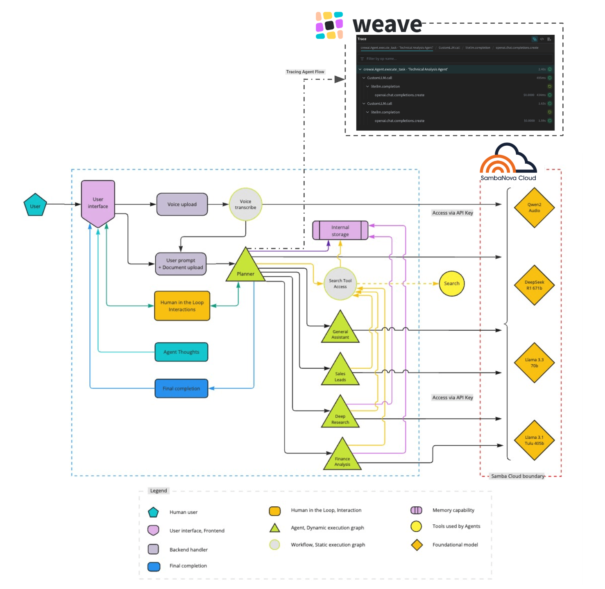

<p align="center">
  
  
</p>

<h1 style="font-size: 3em;">Agents</h1>

This repo is used for Weight and Biases and SambaNova Webniar. You can find the related blog here: LINK TBD 

This Agent application routes requests to four different agents: General assistant agent, Sales leads agent, Deep research agent, and a Finance analysis agent. The agents process tens of thousands of tokens that generates lightning fast and accurate results. 

The basic process of the Agents application is described below.

1. User query processing
1. Agent assignment
1. Data retrieval and processing
1. Response generation


> **Note**: This application uses Weave by Weights & Biases to track agent interactions. [Learn more about Weave traces your agents.](https://weave-docs.wandb.ai/quickstart)


# Prerequisites

Ensure to install the prerequisites.
   - [Python 3.11](https://www.python.org/downloads/release/python-31111/) (exact version required)
   - [Node.js 18.17.0 or later](https://nodejs.org/en/download)
   - [Yarn](https://classic.yarnpkg.com/en/docs/install)
   - [Redis](https://redis.io/download) (via Docker or Homebrew)
     
      ```bash
      # Install Redis with Docker
      docker run --name redis -p 6379:6379 -d redis
      ```
      ```bash
      # Install Redis with Homebrew on macOS
      brew install redis
      brew services start redis
      ```

Get the following API keys to setup the Agents application.
   - [SambaNova API key](https://cloud.sambanova.ai/)
   - [Weights and Baises API key](https://wandb.ai/)
   - [Exa API key](https://exa.co/) for company data collection
   - [Tavily API key](https://tavily.com/) for deep research 
   - [Clerk](https://clerk.com/) for authentication (you'll need both publishable and secret keys)

### Clerk authentication setup

1. Sign up for a Clerk account at [clerk.com](https://clerk.com/).
1. Create a new application in the Clerk dashboard.
1. Get your publishable key and secret key.
1. Configure your JWT issuer URL.
1. Add these values to your environment variables as shown above.

>**Note**: The DeepSeek-R1-8K model is supported in this application via SambaNova Cloud.

# Application and Environment variables Setup

## Environment variables setup

#### Frontend environment variables

> **Note**: For the frontend environment variables, go to `/frontend/sales-agent-crew/`.

1. Create a `.env` file with the following variables.
   ```bash
   VITE_API_URL=/api
   VITE_WEBSOCKET_URL=ws://localhost:8000
   VITE_CLERK_PUBLISHABLE_KEY=your_clerk_publishable_key
   ```

#### Backend environment variables

> **Note**: For the backend environment variables, go to `/backend/`.

1. Create a `.env` file with the following required variables.
   ```bash
   # Authentication
   CLERK_SECRET_KEY=your_clerk_secret_key
   CLERK_JWT_ISSUER=https://your-clerk-instance.clerk.accounts.dev/.well-known/jwks.json
   
   # API Keys for Services
   EXA_API_KEY=your_serper_api_key
   TAVILY_API_KEY=your_tavily_api_key  # Required for Deep Research agent
   
   WANDB_API_KEY=your_wandb_key
   WANDB_PROJECT=your_unique_project_name

   ```
## Application Setup
   
### Frontend setup

Follow the steps below to install the frontend for the Agents application.

> **Note**: For the following commands, go to `/frontend/sales-agent-crew/` directory.

1. Install Vue.js dependencies.

   ```bash
   yarn install
   ```

1. Run a local development environment.

   ```bash
   yarn dev
   ```

1. Create a production build.

   ```bash
   yarn build
   ```

### Backend setup

Follow the steps below to install the backend for the Agents application.

> **Note**: For the following commands, go to `/backend/` directory.

1. Install Python dependencies: Create and activate a virtual environment (for example with venv) and install the project dependencies inside it. Make sure to use Python 3.11.

   ```bash
   python3.11 -m venv venv
   source venv/bin/activate
   pip install -r requirements.txt
   ```

2. Run the application.

   ```bash
   uvicorn api.lead_generation_api:create_app --reload --host 127.0.0.1 --port 8000
   ```
   
# Lauching the application 

1. Start Redis

   ```bash
   brew services start redis
   ```

2. Start the FastAPI backend server.

   ```bash
   # From the project root
   cd backend
   uvicorn api.lead_generation_api:create_app --reload
   ```

3. Start the Vue.js frontend development server.

   ```bash
   # From the project root
   cd frontend/sales-agent-crew/
   yarn dev
   ```

4. Open your browser and navigate to:

   ```bash
   http://localhost:5174/
   ```

# Architecture



This application is built with:

- Vue 3 + Composition API
- Vite
- TailwindCSS
- Clerk for authentication
- Axios for API calls

# Technology stack

The stack is designed to offer high-performance and scalability for both frontend and backend needs. See the frontend and backend technology stack listed in the table below.

<table style="width:40%; border: 1px solid #000; border-collapse: collapse;">
  <thead>
      <tr style="background-color: #f0f0f0;"> <!-- Shading applied here -->
      <th style="border: 1px solid #000; width: 30%; text-align: left; vertical-align: top;">Category</th>
      <th style="border: 1px solid #000; width: 80%; text-align: left; vertical-align: top;">Technologies used</th>
    </tr>
  </thead>
  <tbody>
    <tr>
      <td style="border: 1px solid #000; width: 30%; text-align: left; vertical-align: top;"><strong>Frontend</strong></td>
      <td style="border: 1px solid #000; width: 80%; text-align: left; vertical-align: top;">
        <ul>
          <li>Vue.js 3 (Composition API)</li>
          <li>TailwindCSS for styling</li>
          <li>Vite for build tooling</li>
          <li>Clerk for authentication</li>
        </ul>
      </td>
    </tr>
    <tr>
      <td style="border: 1px solid #000; width: 30%; text-align: left; vertical-align: top;"><strong>Backend</strong></td>
      <td style="border: 1px solid #000; width: 80%; text-align: left; vertical-align: top;">
        <ul>
          <li>FastAPI</li>
          <li>CrewAI</li>
          <li>SambaNova Agentic Cloud</li>
          <li>Exa Search API</li>
          <li>Tavily API for research</li>
          <li>Redis for caching</li>
          <li>Financial Data APIs</li>
        </ul>
      </td>
    </tr>
  </tbody>
</table>


# Features

## Intelligent query routing

The application automatically determines the best category for your query, ensuring efficient processing. Query routing is automatically done for use-cases such as:

- Sales lead information gathering
- Educational content/research creation
- Financial analysis and market research

## Voice input support

The application allows you to make queries using audio input. Simply click the microphone icon to start speaking. It also offers:

- Automatic speech-to-text transcription
- Hands-free operation for convenience

## Additional features

Additional features of the application are listed below.

- 🔐 Secure API key management – Encrypted for maximum protection
- 📜 Chat history tracking – Easily access past conversations
- 📥 Results export functionality – Download and share insights effortlessly
- 🔄 Real-time query routing – Instant categorization for accurate responses
- 📊 Detailed company insights – In-depth business data at your fingertips
- 💹 Financial analysis and market trends – Stay ahead with real-time analytics
- ✍ AI-generated outreach templates – Craft professional messages instantly


# License

[MIT License](LICENSE)

Project Forked from [SambaNova Deepresearch Agent](https://github.com/sambanova/agents)
